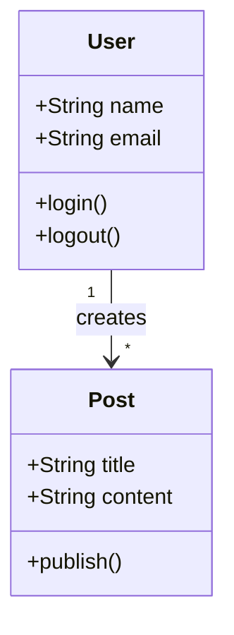
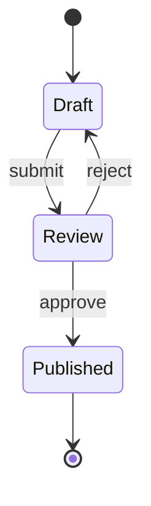
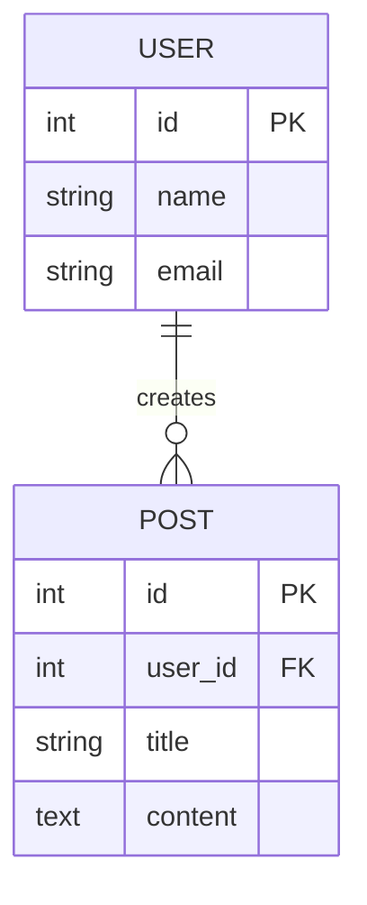
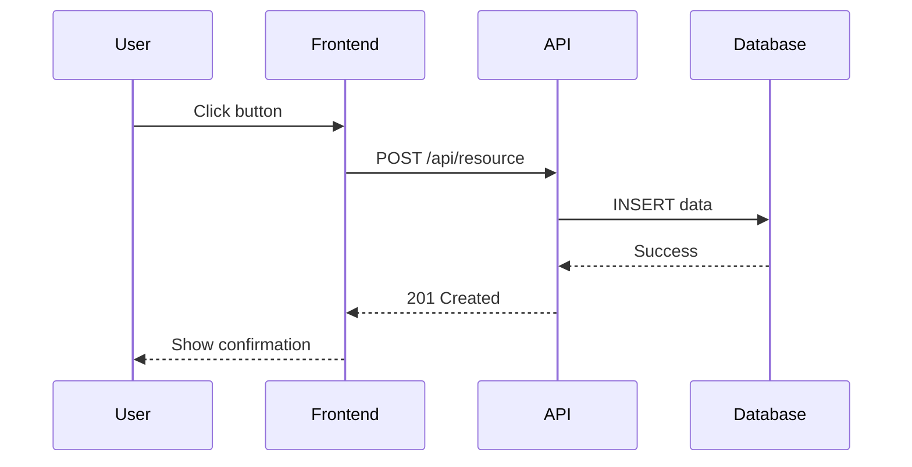

# Mermaid Diagram Type Reference

Additional per-type examples for the `mermaid-diagrams` skill. All rules from SKILL.md apply: never use parentheses inside labels, and always match brackets.

## Class Diagram

## State Diagram

## Entity Relationship Diagram

## API Flow (Sequence)

