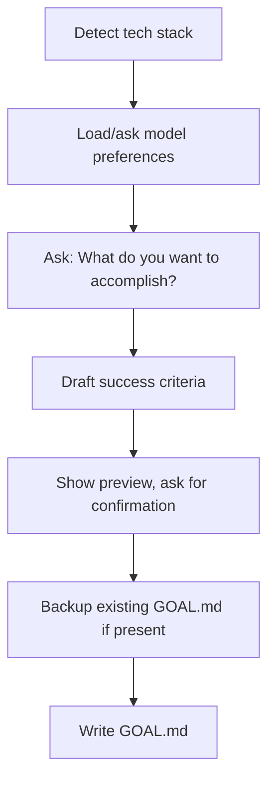

# SGAI Goal Authoring

Compose GOAL.md files for SGAI workspaces through interactive conversation.

## When to Use

- User says "start a new feature/project/fix"
- User describes work to be done in an SGAI-managed repo
- User asks to "create a goal" or "set up SGAI"

## Process



### 1. Detect Tech Stack

Scan the repository for files and choose appropriate agents:

| Detection | Stack | Developer Agent | Reviewer Agent |
|-----------|-------|-----------------|----------------|
| `go.mod` | Go backend | backend-go-developer | go-readability-reviewer |
| `package.json` + react deps | React | react-developer | react-reviewer |
| `package.json` + htmx deps | HTMX | htmx-picocss-frontend-developer | htmx-picocss-frontend-reviewer |
| `*.sh`, `Makefile`, or CLI tool | Shell | shell-script-coder | shell-script-reviewer |
| `wrangler.toml` | Cloudflare Worker | general-purpose | cloudflare-worker-deployer |
| `vercel.json` or Next.js | Vercel | react-developer | vercel-deployer |
| Python + Claude SDK | Agent SDK | general-purpose | agent-sdk-verifier-py |
| TypeScript + Claude SDK | Agent SDK | general-purpose | agent-sdk-verifier-ts |
| Python + OpenAI SDK | OpenAI Agent | general-purpose | openai-sdk-verifier-py |
| TypeScript + OpenAI SDK | OpenAI Agent | general-purpose | openai-sdk-verifier-ts |
| None detected | General | general-purpose | — |

Multiple stacks combine (e.g., Go + React = both agent chains).

**Special-purpose agents** (add when relevant):
- `c4-code`, `c4-component`, `c4-container`, `c4-context` - Architecture documentation
- `skill-writer` - Creating SGAI skills
- `snippet-writer` - Reusable code patterns
- `webmaster` - Marketing sites and landing pages
- `project-critic-council` - Multi-model consensus review

### 2. Load or Ask Model Preferences

Check `.sgai/preferences.json` for saved preferences:

```json
{
  "models": {
    "coordinator": "anthropic/claude-opus-4-6 (max)",
    "default": "anthropic/claude-opus-4-6"
  }
}
```

If no preferences exist, ask:
> "What model should I use for SGAI agents? (e.g., anthropic/claude-opus-4-6)"

Save response to `.sgai/preferences.json` for future use.

### 3. Ask for Goal Description

Ask conversationally:
> "What do you want to accomplish?"

Listen for:
- **Feature**: "add", "build", "create", "implement"
- **Fix**: "bug", "fix", "broken", "error", "issue"
- **Project**: "new project", "set up", "initialize"

If unclear, ask:
> "Is this a new feature, a bug fix, or a new project?"

### 4. Draft Success Criteria

Transform the description into outcome-based success criteria:

**User says:** "Add user authentication with OAuth"

**Draft as:**
```markdown
- [ ] Users can sign in with OAuth providers
- [ ] Authenticated sessions persist across browser restarts
- [ ] Unauthenticated users are redirected to login
```

**Do NOT write implementation steps** like:
- ~~Install passport.js~~
- ~~Create auth middleware~~
- ~~Add login route~~

Ask: "Does this capture what success looks like?"

### 5. Build Flow Graph

Compose flow based on detected stack. Pattern: `developer -> reviewer -> stpa-analyst`

**Go backend:**
```yaml
flow: |
  "backend-go-developer" -> "go-readability-reviewer"
  "go-readability-reviewer" -> "stpa-analyst"
```

**React frontend:**
```yaml
flow: |
  "react-developer" -> "react-reviewer"
  "react-reviewer" -> "stpa-analyst"
```

**HTMX frontend:**
```yaml
flow: |
  "htmx-picocss-frontend-developer" -> "htmx-picocss-frontend-reviewer"
  "htmx-picocss-frontend-reviewer" -> "stpa-analyst"
```

**Go + React (full stack):**
```yaml
flow: |
  "backend-go-developer" -> "go-readability-reviewer"
  "go-readability-reviewer" -> "stpa-analyst"
  "react-developer" -> "react-reviewer"
  "react-reviewer" -> "stpa-analyst"
```

**Shell/CLI tools:**
```yaml
flow: |
  "shell-script-coder" -> "shell-script-reviewer"
  "shell-script-reviewer" -> "stpa-analyst"
```

**Python/general with shell:**
```yaml
flow: |
  "general-purpose" -> "stpa-analyst"
  "shell-script-coder" -> "shell-script-reviewer"
  "shell-script-reviewer" -> "stpa-analyst"
```

**Architecture documentation:**
```yaml
flow: |
  "c4-code" -> "c4-component"
  "c4-component" -> "c4-container"
  "c4-container" -> "c4-context"
```

**General (no stack detected):**
```yaml
flow: |
  "general-purpose" -> "stpa-analyst"
```

Always include `stpa-analyst` as terminal node for safety analysis (except pure documentation flows).

### 6. Detect Completion Gate

Look for test commands:

| File | Gate Script |
|------|-------------|
| `go.mod` | `go test ./...` |
| `package.json` with test script | `npm test` |
| `Makefile` with test target | `make test` |
| None | Omit `completionGateScript` |

### 7. Show Preview

Display the complete GOAL.md and ask:
> "Here's the goal file. Ready to write it?"

### 8. Backup and Write

If `GOAL.md` exists:
1. Rename to `GOAL.md.YYYY-MM-DD-HHMMSS.bak`
2. Inform user of backup

Write new `GOAL.md` to repository root.

## GOAL.md Format

```yaml
---
flow: |
  "agent-a" -> "agent-b"
  "agent-b" -> "stpa-analyst"
models:
  "coordinator": "anthropic/claude-opus-4-6 (max)"
  "agent-a": "anthropic/claude-opus-4-6"
  "agent-b": "anthropic/claude-opus-4-6"
  "stpa-analyst": "anthropic/claude-opus-4-6"
interactive: yes
completionGateScript: go test ./...
---

Brief description of the goal in 1-2 sentences.

## Success Criteria

- [ ] Outcome-based criterion 1
- [ ] Outcome-based criterion 2
- [ ] Outcome-based criterion 3
```

## Available Agents

### Development Agents
| Agent | Use For |
|-------|---------|
| backend-go-developer | Go APIs, CLIs, services |
| react-developer | React frontends |
| htmx-picocss-frontend-developer | Lightweight HTMX + PicoCSS UIs |
| shell-script-coder | Shell scripts, CLI tools |
| general-purpose | Multi-domain tasks, Python, other languages |
| webmaster | Marketing sites, landing pages |

### Review Agents
| Agent | Use For |
|-------|---------|
| go-readability-reviewer | Go code style and idioms |
| react-reviewer | React code review |
| htmx-picocss-frontend-reviewer | HTMX/Pico visual consistency |
| shell-script-reviewer | Shell script correctness |
| stpa-analyst | Safety/hazard analysis (terminal node) |
| project-critic-council | Multi-model consensus evaluation |
| cli-output-style-adjuster | Unix-philosophy CLI compliance |

### Verification Agents
| Agent | Use For |
|-------|---------|
| agent-sdk-verifier-py | Validate Python Claude Agent SDK apps |
| agent-sdk-verifier-ts | Validate TypeScript Claude Agent SDK apps |
| openai-sdk-verifier-py | Validate Python OpenAI Agents SDK apps |
| openai-sdk-verifier-ts | Validate TypeScript OpenAI Agents SDK apps |

### Deployment Agents
| Agent | Use For |
|-------|---------|
| cloudflare-worker-deployer | Deploy Cloudflare Workers |
| vercel-deployer | Deploy to Vercel |
| exe-dev-deployer | Deploy executable dev environments |

### Documentation Agents (C4 Model)
| Agent | Use For |
|-------|---------|
| c4-code | Code-level documentation with Mermaid |
| c4-component | Logical component architecture |
| c4-container | Deployment units and containers |
| c4-context | High-level system context diagrams |

### Meta Agents
| Agent | Use For |
|-------|---------|
| coordinator | Workflow orchestration (implicit) |
| skill-writer | Create validated SGAI skills |
| snippet-writer | Create reusable code snippets |
| retrospective | Analyze completed sessions |

## File References

To include context like screenshots or specs, add files to the repo and reference them:

```markdown
See `docs/mockup.png` for the desired layout.
Refer to `specs/api.md` for endpoint requirements.
```

## Decisions Made by This Skill

- **Interactive mode**: Always `yes` (agents ask clarifying questions)
- **stpa-analyst**: Always included as terminal reviewer
- **Preferences location**: `.sgai/preferences.json` in project
- **Backup naming**: `GOAL.md.YYYY-MM-DD-HHMMSS.bak`
- **Success criteria style**: Outcome-based, not implementation steps
