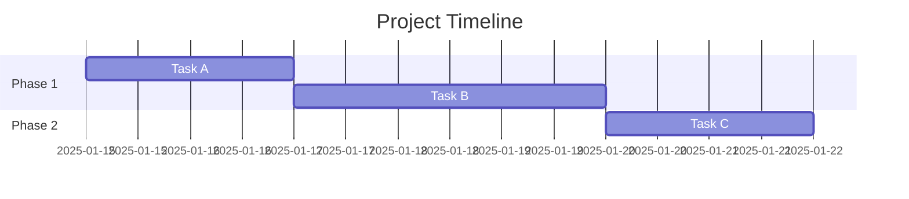
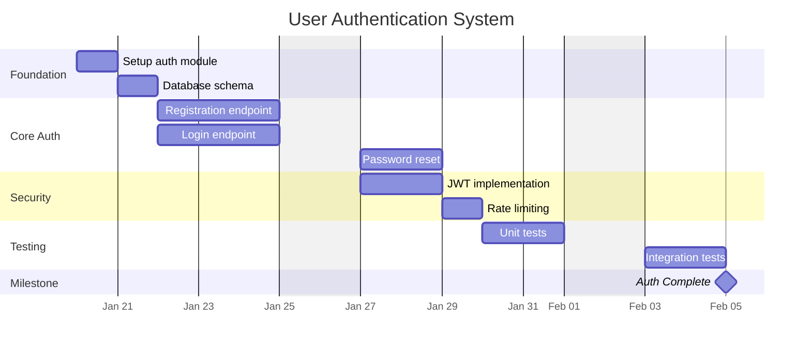

# Timeline Planning Skill

Generate Mermaid Gantt charts that visualize project timelines, task scheduling, phases, and milestones based on GitHub issues and their estimates.

## When to Use

Activate this skill when:
- User asks "what would the timeline look like?"
- User says "create a Gantt chart", "show me the project schedule"
- After running the `issue-decomposition` skill, to visualize scheduling of the resulting issues
- During sprint planning to allocate work

## Mermaid Gantt Syntax

### Basic Structure



### Key Elements

- `title` - Chart title
- `dateFormat` - How dates are parsed
- `section` - Groups related tasks
- Task format: `Name :id, start, duration`

### CRITICAL: Never put a colon in a task name

Mermaid splits each task row at the **first** colon. Any colon inside the task name silently
eats the rest of the row — no parse error, no warning, just a wrong label on a chart that still
renders. This bites constantly because real issue titles are full of colons
(`skill: timeline-planning — update`, `fix: handle empty input`).

**WRONG** — renders as a task literally labelled `#49 skill`:
```
#49 skill: timeline-planning — update :i49, 2026-09-15, 3d
```

**CORRECT** — replace each colon with ` -`:
```
#49 skill - timeline-planning — update :i49, 2026-09-15, 3d
```

Sanitize every title before emitting it: replace `:` with ` -`, then collapse runs of whitespace.

Parentheses and commas are safe *inside a Gantt task name* — unlike flowchart node labels, where
`dependency-mapping` and `mermaid-diagrams` correctly forbid parentheses. Do not strip them here;
only the colon matters. (A comma **after** the name is a field separator and still significant.)

### Task IDs

Derive the id from the issue number — `i<number>` — so every bar traces back to its issue and the
same issue can never appear twice under two ids. Prefix the visible name with `#<number>` too.

## Estimate to Duration Conversion

### Where estimates actually live

Look in this order and stop at the first hit:

1. **A size/effort label.** Lowercase it, strip a leading `size` / `effort` / `estimate` /
   `t-shirt` token *and the one separator that follows it*, and look the remainder up in the table
   below: `effort/large` → `large`, `size/M` → `m`, `size:medium` → `medium`,
   `effort/x-large` → `x-large`. Do **not** split on every `-`, or `x-large` collapses to `large`
   and an XL task gets sized as an L.
2. **The issue body.** `issue-decomposition` — the upstream skill in this chain — writes the
   estimate into the body under an `## Estimate` heading, *not* into a label. Read the first
   word of that section.
3. **A numeric points field** in the body (`Story points: 5`), if the project uses one: treat
   points as days only if the user confirms the mapping; otherwise ask.
4. **Nothing found** → fall through to the No Estimates edge case below.

Never assume a repo uses the words "Small/Medium/Large/XL" verbatim. Run `gh label list` first to
see the vocabulary in play; most repos use something else.

### Conversion table

| Estimate (normalized) | Also written as | Duration | Notes |
|---|---|---|---|
| Small | `s`, `xs`, `tiny`, `small` | 1d | Single-day task |
| Medium | `m`, `medium` | 3d | Few days of work |
| Large | `l`, `large` | 5d | Almost a week |
| XL | `xl`, `xxl`, `x-large`, `huge` | 8d | Full week+ |

These upper bounds match `issue-decomposition`'s estimation table, so a decomposition and its
timeline agree. Adjust for team velocity, complexity indicators, and buffer for unknowns.

Report the mapping you used — issue, estimate, source, duration — so the user can correct a bad
label read before you draw anything.

## Task States

| Modifier | Meaning | Example |
|----------|---------|---------|
| `done` | Completed | `Task A :done, a, 2025-01-15, 2d` |
| `active` | In progress | `Task B :active, b, after a, 3d` |
| `crit` | Critical path | `Task C :crit, c, after b, 5d` |
| `milestone` | Milestone | `MVP :milestone, m, after c, 0d` |

## Timeline Patterns

Reusable Gantt patterns are in [gantt-patterns.md](gantt-patterns.md): linear project, parallel
workstreams, milestones, critical path, and one built from real GitHub issues. Pick the pattern
that matches the dependency shape you found in Step 4 and adapt it — don't start from scratch.

## Timeline Generation Process

### Step 1: Gather Issues

Prerequisite: the `gh` CLI. Fetch everything the later steps consume in one call:

```bash
gh issue list --state open --limit 100 \
  --json number,title,labels,body,milestone,blockedBy,blocking,parent
```

The three relationship fields matter: **`labels` and `body` alone cannot see GitHub's native issue
dependencies or sub-issues**, so a fetch without them silently reports "no dependencies" on a repo
that has them. `milestone` is what Step "After Generating Timeline" needs to flag a missed deadline.

Field shapes to expect:

| Field | Shape | Read |
|---|---|---|
| `blockedBy` / `blocking` | `{"nodes": [...], "totalCount": N}` | `.blockedBy.nodes[].number` |
| `parent` | object or `null` | `.parent.number` |
| `milestone` | object or `null` | `.milestone.dueOn` |

Note the `nodes`/`totalCount` wrapper — indexing `blockedBy` directly as a list fails.

If `gh` is unavailable, ask the user to paste the issue list instead.

### Step 2: Determine Start Date

- Use today's date as default start
- Or ask user for preferred start date
- Consider sprint boundaries

### Step 3: Convert Estimates

Apply the rules in Estimate to Duration Conversion above, then show the table you derived:

```
#101  effort/small        → 1d   (label)
#102  ## Estimate: Medium → 3d   (body)
#103  none                → 3d   (default, flagged)
```

### Step 4: Respect Dependencies

Read dependencies from these sources, in order of authority:

1. **`blockedBy` / `blocking`** — GitHub's native dependencies. Authoritative when present.
2. **Body text keywords** — same table `dependency-mapping` uses, so the two skills agree:

   | Pattern | Meaning |
   |---|---|
   | "Blocked by #X" | This issue depends on #X |
   | "Depends on #X" | This issue depends on #X |
   | "After #X" | Do this after #X |
   | "Blocks #X" | This issue must complete before #X |
   | "Required for #X" | This issue must complete before #X |
   | "Prerequisite: #X" | This issue depends on #X |

3. **`parent`** — a sub-issue relationship is containment, not sequencing. Do **not** turn it into
   an `after`. A tracking/epic parent is not work; render it as a `section` or a closing
   `milestone`, never as its own bar, or you double-count its children's duration.

Drop references to issues outside the fetched set, and say which ones you dropped.

Then order the tasks:

```
#101 → start immediately
#102 blocked by #101 → after i101
#103 blocked by #101 and #102 → after i101 i102
```

`after` accepts several ids separated by spaces; the task starts when the **last** of them ends.

**Check for cycles before emitting any Mermaid** — see the Circular Dependencies edge case.

### Step 5: Group into Phases

Organize tasks into logical sections: Setup/Foundation, Core Features, Testing, Polish.

### Step 6: Generate Gantt Chart

Start from the closest pattern in [gantt-patterns.md](gantt-patterns.md) and fill in the tasks,
dependencies, and sections. Before emitting, confirm:

- No task name contains a colon
- Every `after` id exists in the chart
- Durations are working days if you set `excludes weekends`, calendar days if you did not

### Step 7: Render-Check the Chart

Mermaid accepts plenty of input that produces a broken picture. Do not hand over a chart you have
not checked: paste it into a Markdown preview, or run
`npx -y @mermaid-js/mermaid-cli -i chart.mmd -o chart.svg` and confirm it produces an SVG with no
`NaN` coordinates and with every task label intact.

## Chart Directives and Formats

| Directive / format | Example | Effect |
|---|---|---|
| `dateFormat` | `dateFormat YYYY-MM-DD` | How *input* dates are parsed |
| `axisFormat` | `axisFormat %b %d` | How axis labels are *printed* |
| `tickInterval` | `tickInterval 1week` | Axis tick spacing — use for plans over ~3 weeks, or daily ticks turn to mush |
| `excludes` | `excludes weekends` | Skip non-working days, so `5d` means five working days |
| `todayMarker` | `todayMarker stroke-width:2px,stroke:#f66` | Highlight today; `todayMarker off` to hide |
| Absolute start | `2025-01-15` | Fixed start date |
| `after id` | `after a` | Start after one task ends |
| `after id id` | `after b d` | Start after the **last** of several tasks ends |
| `Nd` / `Nw` / `Nh` | `3d`, `2w`, `4h` | Duration in days / weeks / hours |
| `0d` | `:milestone, m1, after i, 0d` | Zero-length — for milestones |

Durations are **calendar** days unless you add `excludes weekends`. For sprint planning, set it —
otherwise a 5d task starting Thursday reports a finish date on a weekend.

## Best Practices

1. **Use sections** - Group related tasks for clarity
2. **Show dependencies** - Use `after id` to chain tasks
3. **Mark milestones** - Highlight key deliverables
4. **Indicate critical path** - Use `:crit` for must-do-first tasks
5. **Keep titles short** - Fit in the chart view, and strip colons
6. **Add buffer** - Include slack for unknowns
7. **Render before you deliver** - See Step 7

## Example Output

For a set of issues about user authentication:



## Handling Edge Cases

### No Estimates

If issues lack estimates after checking every source in Estimate to Duration Conversion:
- Use Medium (3d) as default
- List exactly which issues were defaulted, and say the timeline is a guess until they are sized
- If *most* issues are unestimated, say so before drawing — an all-3d chart tells the user nothing
  they didn't already know, and `issue-decomposition` can size the work first

### Circular Dependencies

**Mermaid will not catch this for you.** Given `A after B` and `B after A` it emits a chart with
`NaN` geometry and no error — on GitHub that renders as a blank or mangled diagram, which reads
like a rendering bug rather than a planning bug.

So detect the cycle yourself, before emitting any Mermaid:

1. Build the dependency map from Step 4.
2. Walk it depth-first, tracking the current path; a node you meet twice on one path closes a cycle.
   (Equivalently: repeatedly remove tasks with no unmet dependencies — whatever remains is cyclic.)
3. Report the cycle as an error, naming the issues in the loop: "#102 → #103 → #102".
4. Stop. Do not emit a partial chart, and do not silently break the loop — ask which dependency is
   wrong. A cycle means the plan is impossible, not that the diagram is hard to draw.

### Too Many Tasks

Mermaid renders 25+ rows without complaint; the limit is human, not technical. Past roughly 20–25
bars the chart stops being readable, so:
- Split the work into `section`s — Mermaid has no summary/rollup task, so sections are the only
  grouping it offers
- Past ~25 bars, emit one chart per phase and a small top-level chart of phase-length bars plus
  milestones
- Or suggest filtering to one milestone or sprint

## After Generating Timeline

- Show total project duration
- Identify the end date
- Flag if the end date falls after any `milestone.dueOn` from Step 1, or any deadline the user stated
- Offer to save the chart to a markdown file in the repo
- Suggest adding milestones if missing
- Suggest `dependency-mapping` if the blocking structure needs its own diagram
