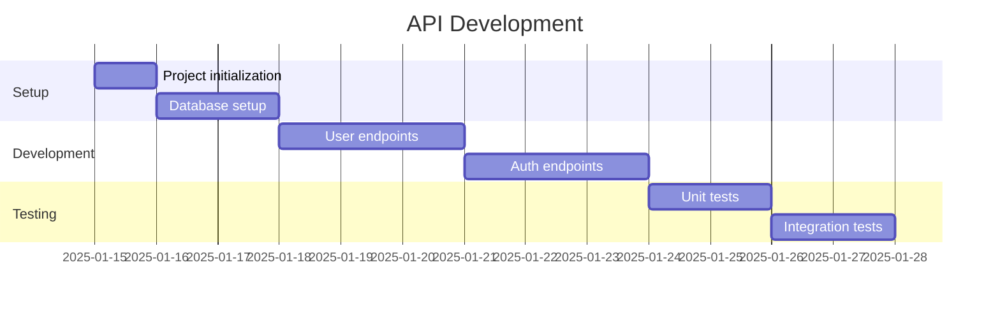
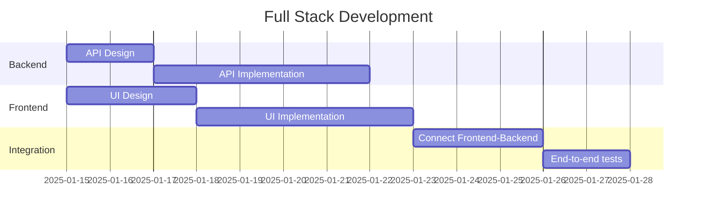
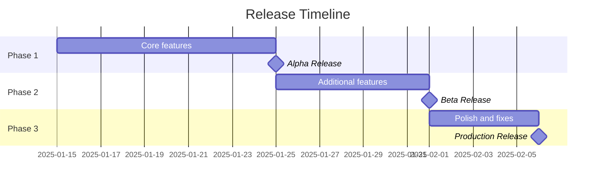
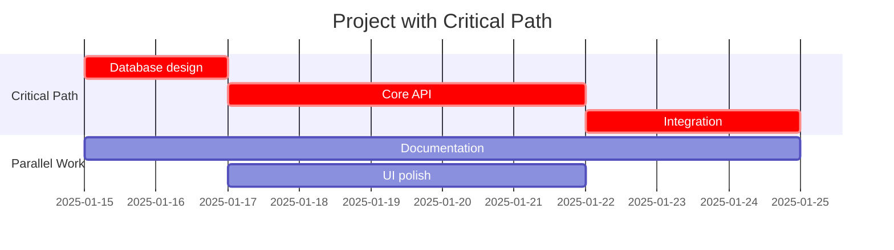
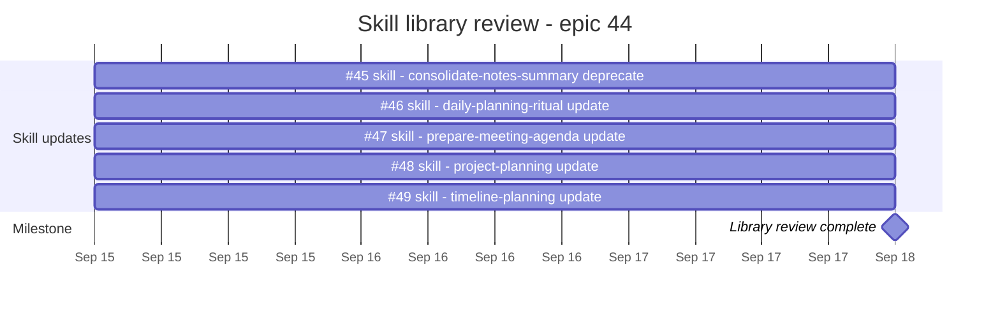

# Gantt Timeline Patterns

Reusable Mermaid Gantt patterns for the timeline-planning skill.

## Linear Project

## Parallel Workstreams

## With Milestones

## With Critical Path

## From Real GitHub Issues

Task names carry the issue number, ids are `i<number>`, and every colon from the original issue
title has been replaced with ` -` so the label survives rendering. The tracking/epic parent issue
is a `section` heading and the closing milestone — not a bar of its own.

All five issues are unestimated, so each bar is the 3d Medium default — flag that when presenting
a chart like this one.
