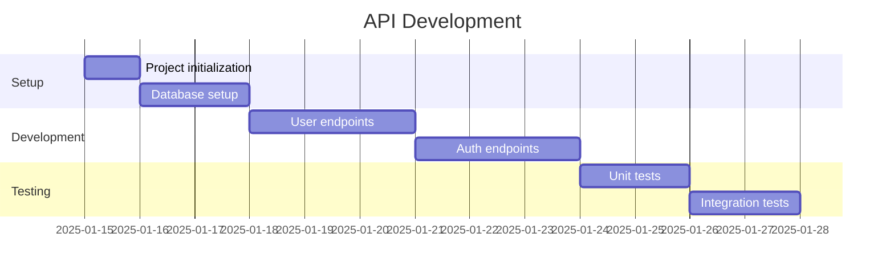
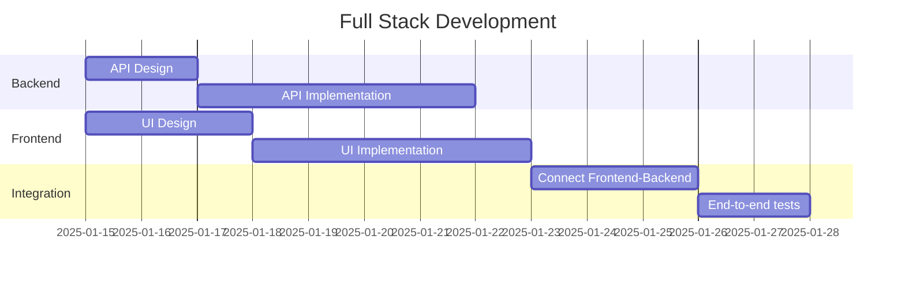
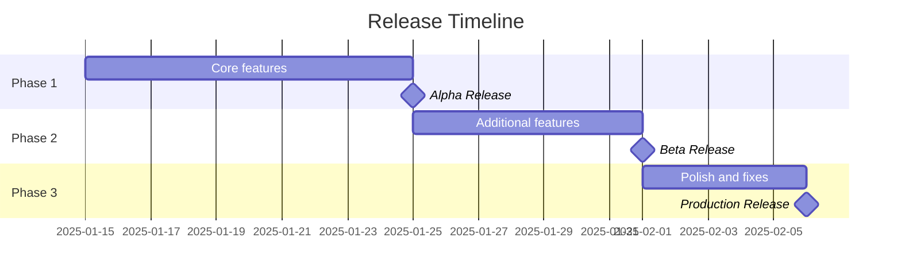
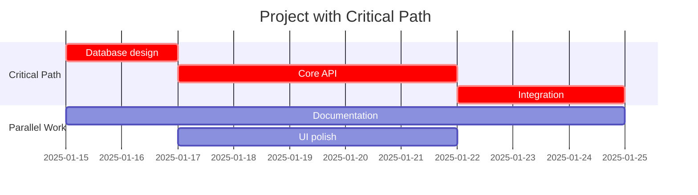

# Gantt Timeline Patterns

Reusable Mermaid Gantt patterns for the timeline-planning skill.

## Linear Project

```mermaid
gantt
    title API Development
    dateFormat YYYY-MM-DD

    section Setup
    Project initialization    :a, 2025-01-15, 1d
    Database setup           :b, after a, 2d

    section Development
    User endpoints           :c, after b, 3d
    Auth endpoints           :d, after c, 3d

    section Testing
    Unit tests               :e, after d, 2d
    Integration tests        :f, after e, 2d
```

## Parallel Workstreams

```mermaid
gantt
    title Full Stack Development
    dateFormat YYYY-MM-DD

    section Backend
    API Design              :a, 2025-01-15, 2d
    API Implementation      :b, after a, 5d

    section Frontend
    UI Design               :c, 2025-01-15, 3d
    UI Implementation       :d, after c, 5d

    section Integration
    Connect Frontend-Backend :e, after b d, 3d
    End-to-end tests        :f, after e, 2d
```

## With Milestones

```mermaid
gantt
    title Release Timeline
    dateFormat YYYY-MM-DD

    section Phase 1
    Core features           :a, 2025-01-15, 10d
    Alpha Release           :milestone, m1, after a, 0d

    section Phase 2
    Additional features     :b, after m1, 7d
    Beta Release            :milestone, m2, after b, 0d

    section Phase 3
    Polish and fixes        :c, after m2, 5d
    Production Release      :milestone, m3, after c, 0d
```

## With Critical Path

```mermaid
gantt
    title Project with Critical Path
    dateFormat YYYY-MM-DD

    section Critical Path
    Database design         :crit, a, 2025-01-15, 2d
    Core API                :crit, b, after a, 5d
    Integration             :crit, c, after b, 3d

    section Parallel Work
    Documentation           :d, 2025-01-15, 10d
    UI polish               :e, after a, 5d
```
